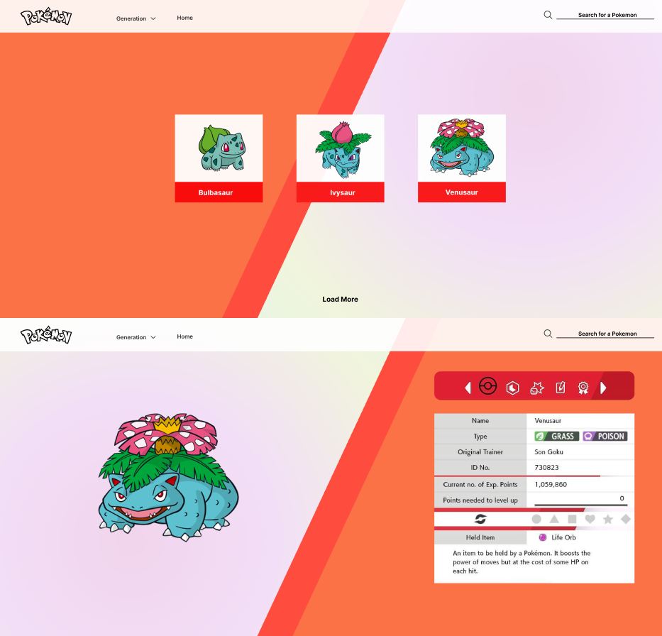

# Project Plan: Pokémon Data Initiative Front-End Development Challenge

## Purpose

The purpose of this project is to develop a responsive and interactive web-based Pokédex application that effectively utilizes the Pokémon API to display detailed Pokémon data. The goal is to create a multifaceted tool that caters to the diverse needs of Pokémon trainers, researchers, and enthusiasts, providing an engaging and informative experience.

## Scope

### Inclusions
- Responsive and interactive Pokédex web application.
- Dynamic Pokémon theme music based on selected generation.
- IV calculator integration.
- Pokémon type strengths and weaknesses information.
- Diverse sorting methods for the main page.
- "I'm Feeling Lucky" button for random Pokémon exploration.
- pokemon battle
- shiny toggle with effect
- mega evolutions
- Pokédex search bar
- filter generation type (breeder group)
- cheat codes
- easter eggs
- background music (generation based)
- pointer hover with information about the pokemon

### Exclusions
- Back-end or data engineering components.
- Complex database interactions.
- Advanced features like Pokémon Trading, Community Forums, or Language Learning Module.

## User Stories and Tasks

### User Stories

| **Name** | **User Story** | **Description** |
| --- | --- | --- |
| **Prof Oak** | **Evolution Chain Analysis** | “As Professor Oak, I want to analyze and visualize the evolution chains of Pokémon so that I can study their development patterns and contribute to evolutionary research.” |
| **Prof Oak** | **Generation and Version Tracking** | “As Professor Oak, I want to track and compare Pokémon across different generations and game versions so that I can observe evolutionary trends and changes over time.” |
| **Prof Oak** | **Pokémon Species Documentation** | “As Professor Oak, I want to document detailed information on each Pokémon species so than provide a rich resource for academic and training purposes.” |
| **Brock** | **Move Strategy Planner** | “As Brock, I want a system to plan and compare Pokémon moves, including their damage classes and effects, so that I can develop superior battle strategies.” |
| **Misty** | **Pokémon Form Variations Study** | As Misty, I want to study the different forms that Water-type Pokémon can take to better understand their adaptability and ecological roles.” |

### Tasks

1. Implement the "I'm Feeling Lucky" button for random Pokémon exploration.
2. Incorporate Pokémon type strengths and weaknesses information.
3. Integrate diverse sorting methods for the main page.
4. Implement the IV calculator feature.
5. Integrate dynamic Pokémon theme music based on selected generation.
6.

## Technologies

- HTML5, JavaScript.
- CSS framework: Tailwind.
- Modern JavaScript framework or library (Svelte).
- Pokémon API (PokeAPI).

## Database Design

No back-end or database interactions are required for this front-end development challenge. The application will rely solely on the Pokémon API for fetching data.

## Planning

### Timeline

1. **Day 1**: Set up the project, establish the development environment, and create the basic structure of the application.

### Responsibilities
- **Nathan**: Wireframe.
- **Nathan**: Adding evolution chain.
- **Nathan, Jair**: Diverse sorting methods.
- **Saman**: I'm Feeling Lucky" button and Pokémon type strengths/weaknesses.
- **Saman**: Shiny toggle method.
- **Youssef**: Easter Egg (Pokemon: Fire, Red).
- **Youssef**: Filter generation type (breeder group)
- **Youssef, Saman**: Dynamic Pokémon theme music.
- **Youssef, Saman**: IV calculator.
- **Jair**: Pointer hover with information about the pokemon.
- **Youssef**: Adding Growl sounds.
- **All Team Members**: Testing, bug fixes, and documentation.

## Wireframe
